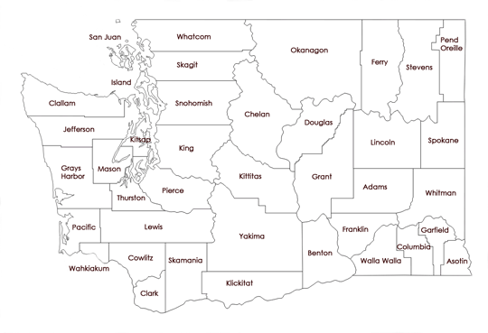

```{r setup-md, echo=FALSE, message=FALSE, warning=FALSE, include=FALSE}
library(knitr)
# Setting up RMarkdown
opts_chunk$set(collapse = TRUE, tidy = TRUE, fig.align='center',
               tidy.opts = list(blank = TRUE, strip.white = TRUE), warning = FALSE, 
               message = FALSE, cache = FALSE, echo=FALSE)
```

```{r setup, eval=T}
# Loading Libraries
library(RColorBrewer) # creates nice color schemes
library(classInt)     # finds class intervals for continuous variables
library(ggplot2)
library(rgdal)
library(SUMMER)
library(maps)
library(maptools)
library(dplyr)
library(sf)
library(INLA)
library(prioritizr)
library(truncnorm)
```

## WA State County Names Reference:
```{r, echo = FALSE, warning = FALSE, message = FALSE, results = FALSE}
# Reading in WA state County Shapefiles
# Data from: https://geo.wa.gov/datasets/wadnr::wa-county-boundaries/explore?location=47.182649%2C-120.817600%2C7.57
washington <- rgdal::readOGR(dsn="WA_County_Boundaries",layer="WA_County_Boundaries")
```


```{r sp-data, echo = FALSE, warning = FALSE, message = FALSE}
# Converting WA census tract to a polygon DF
wmap <- SpatialPolygons(washington@polygons) # getting Geometries
washington$geometry <- st_as_sfc(wmap) # adding geometry column
wmap <- st_as_sf(washington)
# selecting important columns
wmap <- wmap[,c("JURISDIC_2", "geometry")]
colnames(wmap) <- c('County', "geometry")
```

```{r read-cancer, echo = FALSE, warning = FALSE, message = FALSE,}
# Reading cancer data (pre-cleaned)
cancer <- read.csv("Lung_Cancer_Deaths_2015-2019.csv", header = TRUE)
# Selecting Columns
cancer <- cancer[, c("County", "Count", "Population", "Age.Adjusted.Rate.per.100.000")]

# Dropping the 3 counties with missing data:
cancer$Age.Adjusted.Rate.per.100.000[is.na(cancer$Age.Adjusted.Rate.per.100.000)] <- 36.4
cancer$Count[is.na(cancer$Count)] <- 0
#cancer <- na.omit(cancer)

# Merging with spatial object
merge <- merge(cancer, wmap, by.x='County', by.y='County')
wa <- st_as_sf(merge)

# Expected Morbidity:
wa$Expected <- wa$Population / 100000 * wa$Age.Adjusted.Rate.per.100.000
```


```{r SMR-map, echo = FALSE, warning = FALSE, message = FALSE, fig.cap=c('SMR for Male Lung Cancer in WA, 2015-2019', 'SMR Map Standard Errors')}
# Adding SMR column
wa$SMR <- wa$Count/wa$Expected
wa$se <- sqrt(wa$SMR/wa$Expected)
```

\newpage
## IID Estimates:


```{r inla-iid, eval=T, fig.cap="IID Model Output"}
# Fit Poisson-Lognormal model in INLA:
model.fit0 <- inla(Count ~ 1 + f(County, model="iid"),
                   data=wa, family="cenpoisson", 
                   E=Expected, 
                   control.family = list(cenpoisson.I = c(0, 5)),
                   control.predictor = list(compute = TRUE), 
                   control.compute= list(return.marginals=TRUE))
```

```{r, echo = FALSE, warning = FALSE, message = FALSE, fig.subcap=c('Poisson Lognormal Non-spatial', 'Posterior Standard Deviations'), fig.cap='Poisson Lognormal Non-Spatial Mapping', fig.ncols=2, out.width="50%",fig.sep=c('', '')}
options(scipen=999) # no sci.notation
# Extracting the posterior medians using our fitted model
wa$fit0fitted <- model.fit0$summary.fitted.values$`0.5quant`
wa$fit0se <- model.fit0$summary.fitted.values$`sd`

# Mapping our results
pal = function(n) brewer.pal(n,"BuPu")
plot(wa["fit0fitted"], pal = pal, nbreaks = 8, breaks = "equal", main=NULL)
plot(wa["fit0se"], pal = pal, nbreaks = 8, breaks = "equal", main=NULL)
```


## Supplementary Code Appendix

```{r ref.label=knitr::all_labels(), echo=TRUE, eval=FALSE}
```


